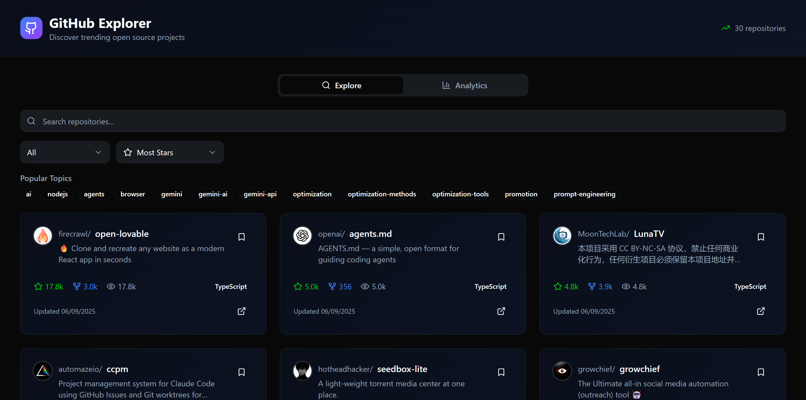

## Github Explorer


## Introduction

GitHub Explorer is a modern web application designed to help users search, filter, and analyze GitHub repositories efficiently. Built with a focus on usability and performance, the project leverages the latest frontend technologies to deliver a seamless user experience for developers and tech enthusiasts.

## Abstract

The GitHub Explorer project aims to simplify the process of discovering and analyzing repositories on GitHub. Users can search for repositories, apply various filters, and view detailed analytics such as stars, forks, and activity trends. The application integrates with the GitHub API to fetch real-time data and presents it through interactive charts and responsive UI components. This tool is particularly useful for developers seeking inspiration, conducting research, or tracking open-source trends.

## Tools Used

- **React**: Core library for building the user interface.
- **Vite**: Fast development server and build tool.
- **TypeScript**: Provides static typing for improved code quality.
- **Tailwind CSS**: Utility-first CSS framework for rapid UI development.
- **Radix UI**: Accessible and customizable UI primitives.
- **React Hook Form & Zod**: For form management and validation.
- **Chart.js & React-Chartjs-2**: For rendering analytics and data visualizations.
- **Axios**: For making HTTP requests to the GitHub API.
- **ESLint**: For maintaining code quality and consistency.

## Steps Involved in Building the Project

1. **Project Setup**: Initialized the project using Vite with React and TypeScript templates. Configured ESLint, Tailwind CSS, and other development dependencies.
2. **UI Design**: Designed reusable UI components (buttons, cards, dialogs, charts) using Tailwind CSS and Radix UI to ensure accessibility and consistency.
3. **API Integration**: Developed a service layer (`githubApi.ts`) to interact with the GitHub API, handling authentication, search queries, and error management.
4. **State Management**: Utilized React hooks and React Query for efficient state and data fetching management.
5. **Feature Implementation**:
    - **Search & Filters**: Built components for searching repositories and applying filters (e.g., language, stars).
    - **Repository Cards**: Displayed repository details in a user-friendly card format.
    - **Analytics**: Integrated charts to visualize repository statistics and trends.
6. **Testing & Optimization**: Ensured responsiveness, accessibility, and performance across devices. Linted and refactored code for maintainability.
7. **Documentation**: Created a README and in-code documentation for ease of use and future development.

## Conclusion

GitHub Explorer successfully demonstrates how modern web technologies can be combined to create a powerful, user-friendly tool for exploring and analyzing open-source repositories. The project not only streamlines the discovery process but also provides valuable insights through analytics, making it a useful resource for developers and researchers. Future enhancements could include user authentication, personalized dashboards, and deeper analytics features.


---

## 🚀 Features

- **Repository Search:** Find GitHub repositories by keyword.
- **Advanced Filters:** Filter by language, stars, and more.
- **Repository Cards:** View key details at a glance.
- **Analytics:** Visualize repository stats and trends with interactive charts.
- **Responsive UI:** Works seamlessly on desktop and mobile.
- **Accessible Components:** Built with Radix UI primitives and Tailwind CSS.

---

## 🛠️ Tools & Technologies

- [React](https://react.dev/)
- [TypeScript](https://www.typescriptlang.org/)
- [Vite](https://vitejs.dev/)
- [Tailwind CSS](https://tailwindcss.com/)
- [Radix UI](https://www.radix-ui.com/)
- [Chart.js](https://www.chartjs.org/) & [react-chartjs-2](https://react-chartjs-2.js.org/)
- [Axios](https://axios-http.com/)
- [React Hook Form](https://react-hook-form.com/) & [Zod](https://zod.dev/)
- [ESLint](https://eslint.org/)

---


## 🏁 Getting Started

1. **Clone the repository:**
   ```sh
   git clone https://github.com/your-username/github-explorer.git
   cd github-explorer
   ```

2. **Install dependencies:**
   ```sh
   npm install
   # or
   yarn install
   ```

3. **Start the development server:**
   ```sh
   npm run dev
   ```

4. **Open in your browser:**
   ```
   http://localhost:8080
   ```

---


## 📝 License

This project is licensed under the MIT License.

---
